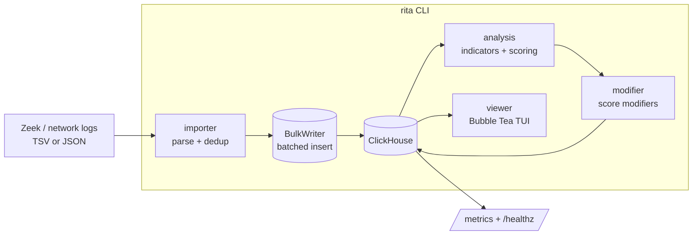

# RITA Architecture

RITA (Real Intelligence Threat Analytics) ingests network logs into ClickHouse,
scores host pairs for likely command-and-control behavior, and presents the
results in a terminal UI.

## High-level pipeline

## Import → analysis → view flow

1. **Import** (`cmd/import.go` → `importer/`): walk the log directory,
   deduplicate files by `hash(path + mtime)`, parse records, and stream them into
   per-log-type tables via `database.BulkWriter`. Connections are then
   "seasoned" — HTTP/SSL logs are linked to their conn records.
2. **Analysis** (`analysis/`): for each internal/external host pair, evaluate
   indicators (beacon, long connection, strobe, C2-over-DNS, threat intel) and
   write a `ThreatMixtape` result row.
3. **Modification** (`modifier/`): apply contextual modifiers (prevalence,
   first-seen, rare signature, MIME-type mismatch) to the scores.
4. **View** (`viewer/`): browse the scored results interactively.

## Packages

| Package | Responsibility |
|---|---|
| `cmd/` | CLI subcommands (urfave/cli); `import` orchestrates the pipeline. |
| `config/` | Load + validate HJSON config merged with `.env` secrets. |
| `database/` | ClickHouse connection/pooling, schema (`tables.go`), MetaDB, and the concurrent `BulkWriter`. |
| `importer/` | Parse and ingest logs; dedup; connection seasoning. |
| `analysis/` | Indicator computation and threat scoring. |
| `modifier/` | Post-scoring contextual modifiers. |
| `viewer/` | Bubble Tea TUI for results. |
| `zonetransfer/` | Optional DNS zone-transfer integration. |
| `util/` | Shared helpers: hashing (`FixedString`), subnets/IP classification, fs validation. |
| `logger/` | Process-wide zerolog logger. |
| `progressbar/` | Progress UI for import/analysis. |
| `metrics/` | Opt-in Prometheus metrics + `/healthz`. |
| `telemetry/` | Opt-in OpenTelemetry tracing. |
| `circuitbreaker/` | Reusable circuit breaker for guarding external/DB calls. |

## Concurrency model

- The importer fans files across parser/digester/writer worker pools sized from
  available CPU cores (`GetAvailableCores` / `SetWorkerCount`).
- `database.BulkWriter` runs a pool of writer goroutines coordinated by an
  `errgroup.Group`; the first write error cancels the group and is returned from
  `Close()` (RITA does **not** call `log.Fatal` on write errors — callers decide).
- Unbuffered hand-off channels between stages provide natural backpressure so a
  slow ClickHouse throttles the parsers instead of growing memory unbounded.
- Insert rate is bounded by a shared `rate.Limiter` (≈5 batches/sec).
