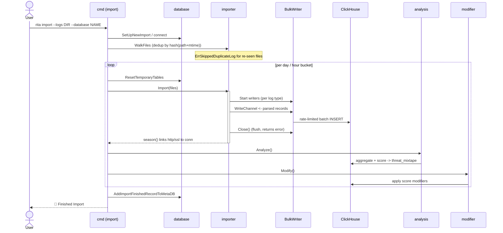
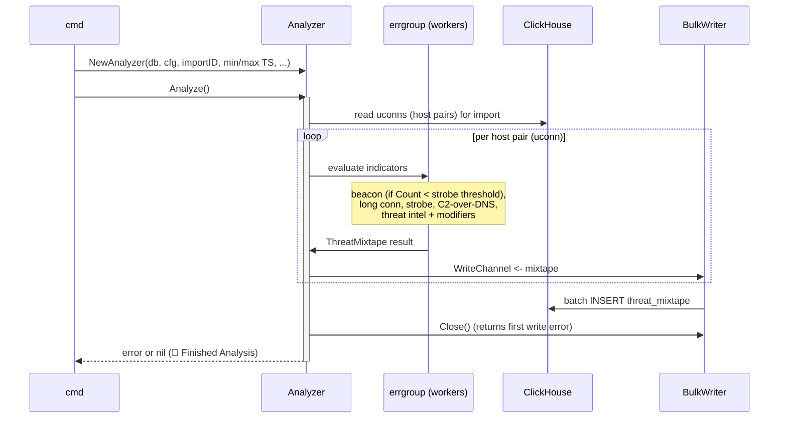

# Sequence Diagrams

## Import workflow

Driven by `RunImportCmd` (`cmd/import.go`).

```mermaid
sequenceDiagram
    actor User
    participant CLI as cmd (import)
    participant DB as database
    participant Imp as importer
    participant W as BulkWriter
    participant CH as ClickHouse
    participant An as analysis
    participant Mod as modifier

    User->>CLI: rita import --logs DIR --database NAME
    CLI->>DB: SetUpNewImport / connect
    CLI->>Imp: WalkFiles (dedup by hash(path+mtime))
    note over Imp: ErrSkippedDuplicateLog for re-seen files
    loop per day / hour bucket
        CLI->>DB: ResetTemporaryTables
        CLI->>Imp: Import(files)
        activate Imp
        Imp->>W: Start writers (per log type)
        Imp->>W: WriteChannel <- parsed records
        W->>CH: rate-limited batch INSERT
        Imp->>W: Close() (flush, returns error)
        Imp-->>CLI: season() links http/ssl to conn
        deactivate Imp
        CLI->>An: Analyze()
        An->>CH: aggregate + score -> threat_mixtape
        CLI->>Mod: Modify()
        Mod->>CH: apply score modifiers
    end
    CLI->>DB: AddImportFinishedRecordToMetaDB
    CLI-->>User: 🎊 Finished Import
```

## Analysis workflow

Driven by `Analyzer.Analyze` (`analysis/`).

```mermaid
sequenceDiagram
    participant CLI as cmd
    participant An as Analyzer
    participant EG as errgroup (workers)
    participant CH as ClickHouse
    participant W as BulkWriter

    CLI->>An: NewAnalyzer(db, cfg, importID, min/max TS, ...)
    CLI->>An: Analyze()
    activate An
    An->>CH: read uconns (host pairs) for import
    loop per host pair (uconn)
        An->>EG: evaluate indicators
        note over EG: beacon (if Count < strobe threshold),<br/>long conn, strobe, C2-over-DNS,<br/>threat intel + modifiers
        EG->>An: ThreatMixtape result
        An->>W: WriteChannel <- mixtape
    end
    W->>CH: batch INSERT threat_mixtape
    An->>W: Close() (returns first write error)
    An-->>CLI: error or nil (🎉 Finished Analysis)
    deactivate An
```
